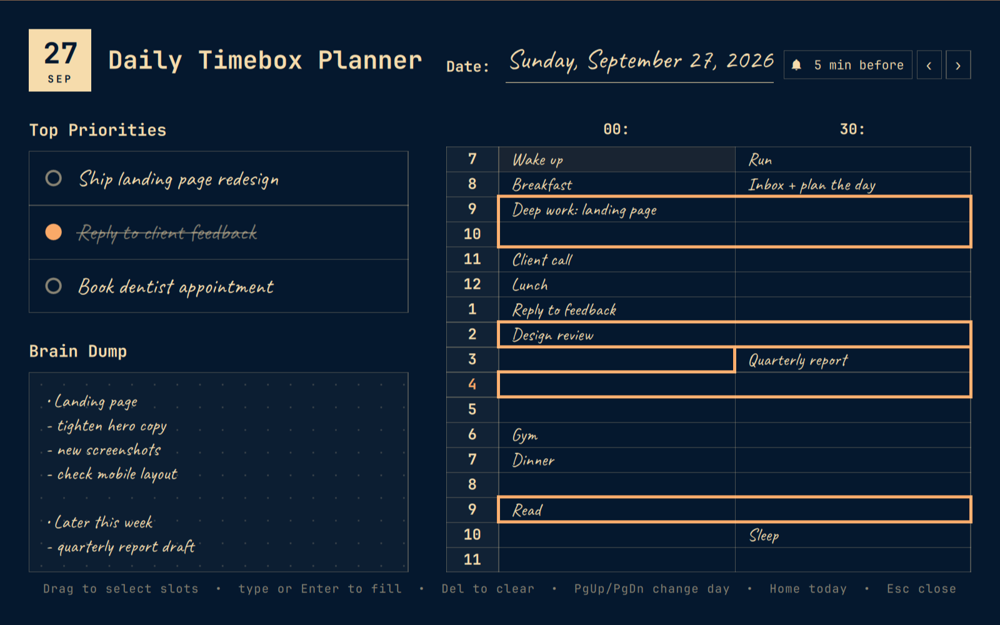

# Timebox Planner for Omarchy

A daily timebox planner for the [Omarchy](https://omarchy.org) shell, modeled on the paper
"Daily Timebox Planner": top priorities, a brain dump, and a half-hour schedule from 7 AM to midnight.
It follows your current Omarchy theme, and everything you write appears in a handwriting font, like pen on the paper original.



- **Top Priorities**: three items; click the circle to mark one done.
- **Brain Dump**: free-form notes on a dotted pad.
- **Schedule**: `:00` / `:30` slots. Consecutive slots with the same text are drawn as one boxed timebox.
- On today's page, the current hour's number is highlighted.
- **Reminders**: a desktop notification when each block starts (e.g. `Deep work · 9:00 AM – 10:30 AM`).
  Click it to open the planner. The bell button next to the date switches between *At start*,
  *5 min before*, *5 min before + start*, and *Off*. Check the next one with `omarchy-shell hawzhin.timebox.reminders next`.
- **Bar widget**: shows the block you're in and how long is left (`Deep work · 56m`),
  or the next block when nothing is scheduled right now. Hover for details; click to open the planner.

## Install

```bash
omarchy plugin add https://github.com/HawzhinOmer/omarchy-timebox.git --enable
```

`--enable` puts the bar widget in the center section. Move it with, for example:

```bash
omarchy bar move hawzhin.timebox --after omarchy.clock
```

Bind the planner to a key in `~/.config/hypr/bindings.lua`:

```lua
o.bind("SUPER + D", "Timebox planner", "omarchy-shell shell toggle hawzhin.timebox")
```

The planner opens as a normal window (close it with Esc or SUPER + Q). To have it open floating
and centered instead of tiled, add this to `~/.config/hypr/hyprland.lua`:

```lua
o.window({ class = "^org.quickshell$", title = "^Timebox Planner$" },
  { float = true, center = true, size = { 1280, 800 }, tag = "-default-opacity", opacity = "1 1" })
```

## Remove

```bash
omarchy plugin remove hawzhin.timebox
```

Then delete the keybinding line from `~/.config/hypr/bindings.lua` (and the window rule from
`~/.config/hypr/hyprland.lua` if you added it). Your saved days stay in
`~/.local/share/omarchy-timebox/`; delete that folder too if you don't want them.

## Requirements

Omarchy with the Quickshell-based shell (Omarchy 4 / Quattro). No other dependencies.

## Keys

| Key | Action |
| --- | --- |
| Click / drag, Shift+click | Select slots |
| Type or Enter | Fill the selected slots (Enter saves, Esc cancels) |
| Del / Backspace | Clear the selected slots |
| Arrows, Shift+arrows | Move / extend the selection |
| PgUp / PgDn | Previous / next day |
| Home | Jump to today |
| Tab | Jump to priorities, then brain dump |
| Esc | Close |

## Bar widget settings

Set these on the widget's entry in `~/.config/omarchy/shell.json`, e.g.
`omarchy bar set hawzhin.timebox maxLength 20`:

| Key | Default | Meaning |
| --- | --- | --- |
| `maxLength` | `28` | Longest block name before it's shortened with `…` |
| `showNext` | `true` | Show the next block when nothing is scheduled right now |

## Data

Each day is saved automatically as JSON in `~/.local/share/omarchy-timebox/YYYY-MM-DD.json`;
the reminder setting lives in `settings.json` in the same folder.
If a day's file can't be read or isn't valid JSON, the planner opens it read-only with a warning
rather than overwriting it.

## License

MIT. The bundled handwriting font, [Caveat](https://github.com/googlefonts/caveat), is licensed
under the SIL Open Font License 1.1 (see `fonts/OFL.txt`).
